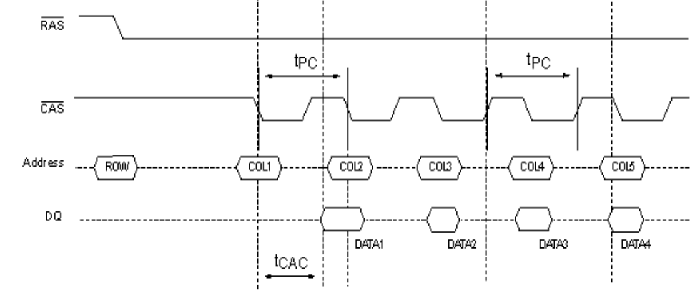
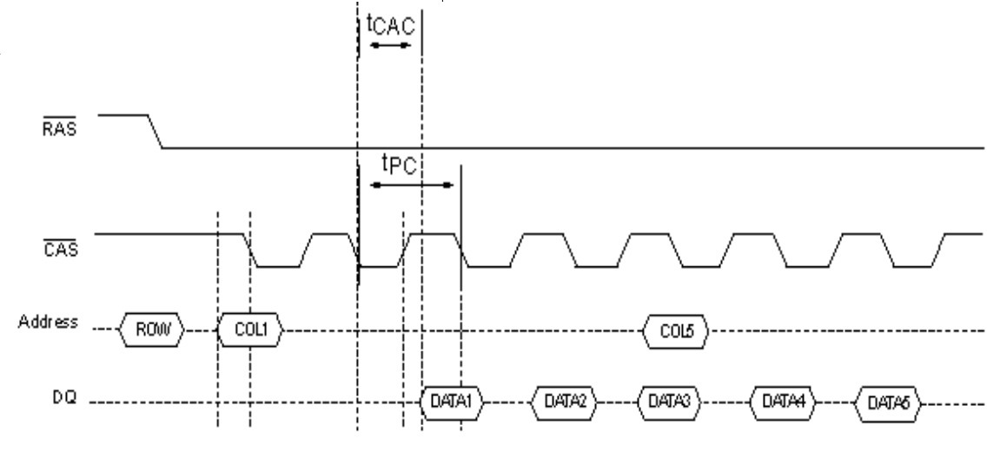
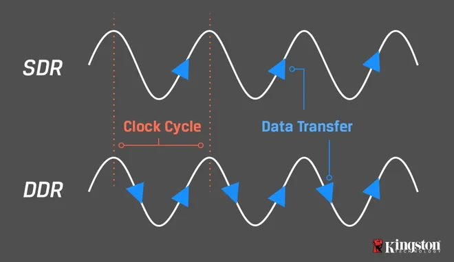
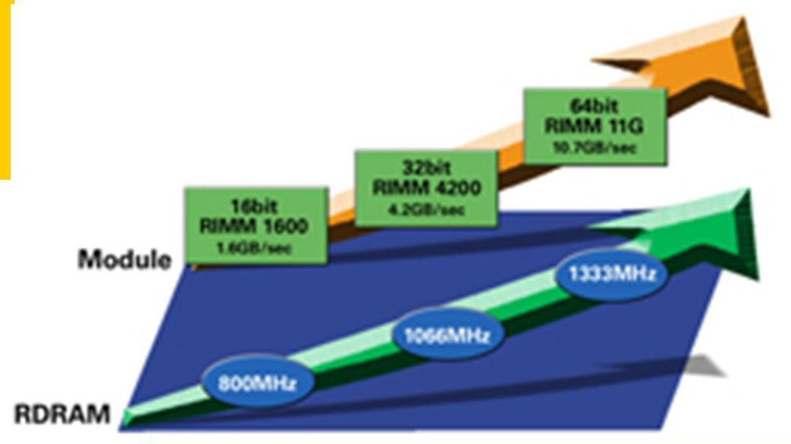
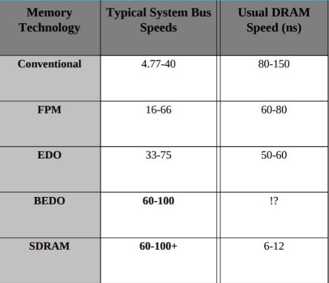

# Memória RAM

Memória Principal / Random Access Memory

---

### Memória RAM

- Armazenamento Volátil
- Feita de semi-condutores
- Mais performática que o HD
    - Carrega os arquivos do HD ou da rede
    - Parte Ativa do OS, softwares e dados

---

### Memória Cache

- SRAM
    - Mais performática que a memória principal
    - Copia dados e instruções da memória RAM

---

### Comunicação MP - Processador

- Leitura / Escrita

# 

---

# SRAM

Static Random Access Memory

Memória RAM Estática

---

### SRAM

- Célula: Circuitos com 6 transistores (flip-flops)
- Dados armazenados
- Maior, mais cara e com menos capacidade de armazenamento
- Memória Cache

---

# DRAM

Dynamic Random Access Memory

Memória RAM Dinâmica

---

### DRAM

- Célula: um transistor e um capacitor
- Precisa receber "Refresh"
- Menor, mais barata e com maior capacidade de armazenamento
- Memória Principal

---

### DRAM VS SRAM

---

# FPM DRAM

Fast Page Mode

Modo de Operação Rapida

---

### Memória FPM

- Controlador de memória faz
até 4 acessos em sequência à DRAM
- Usabilidade

<!--  -->

---

# EDO DRAM

Extend Data Output

Saída Extendida de Dados

---

### Memória EDO

- Trabalho em pares
- Acesso simultâneo a novas posições de memória
enquanto os dados estão sendo lidos na saída

<!--  -->

---

# BEDO DRAM

Burst EDO

---

### Memória BEDO

- Circuito de memória raro
- Possui registrador e
gerador interno de endereços
sequenciais

<!--  -->

---

# SDRAM

Synchronous DRAM

---

### SDRAM

- Trabalha na frequencia do sistema
- Alta performace
- Acesso a memória coordenado pelo clock do sistema

---

### DDR SDRAM

Double Data Rate SDRAM

Transfere dados na subida e descida do clock

---

# DR RRAM

Direct Rambus DRAM

---

### DR DRAM

- Padrão proprietário da Rambus Inc.
- Transferência de dados na subida e descida
do clock
- Usa o Direct Rambus Channel (barramento estreito permite estas taxas altas)
- Barramento de 16 Bits

---

---

Referência:

- [Hierarquia de memória - UFPE](https://www.cin.ufpe.br/~can/Arquivos/infra-hw-hierarquia2-07-1.pdf)

 - Arquitetura de Computadores – PCs
    
    Livro por RENATO RODRIGUES PAIXAO

- Sistemas de Computação. [s.l: s.n.]. [Link](http://www.ic.uff.br/~simone/sistemascomp/contaulas/9_MEM.pdf) 
- Diferença entre SRAM e DRAM. [Link](https://pt.spot-the-difference.info/difference-between-sram)

- [Como funcionam as Memórias RAM? DRAM e SRAM | Cybee Info #02
](https://www.youtube.com/watch?v=WdENjKNMWcc)

---

Tecnologia em Análise e Desevolvimento de Sistemas

Introdução a Informática - UTFPR - PB - 2022

-------------------

Jorge Dorio

Fernando Loff

Renan Matos

Gabriel Conte

